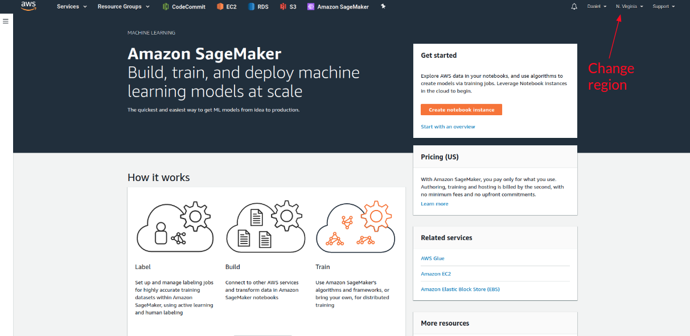
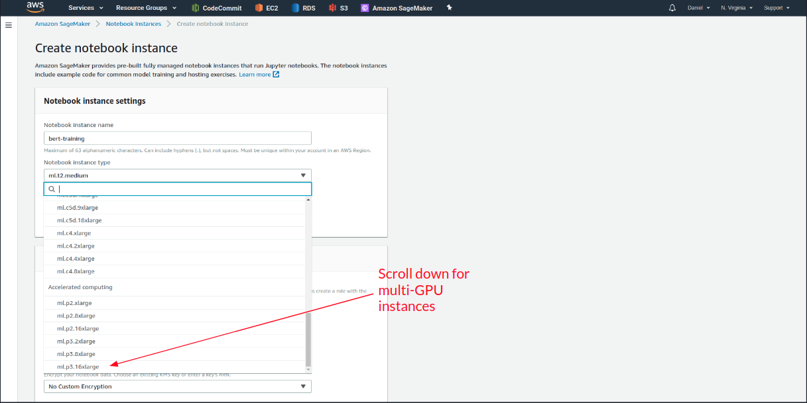
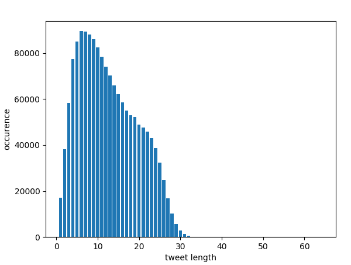
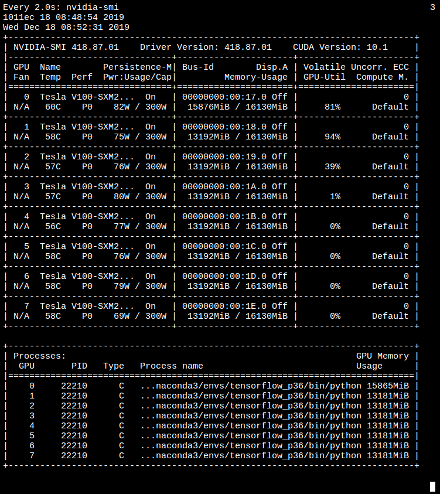
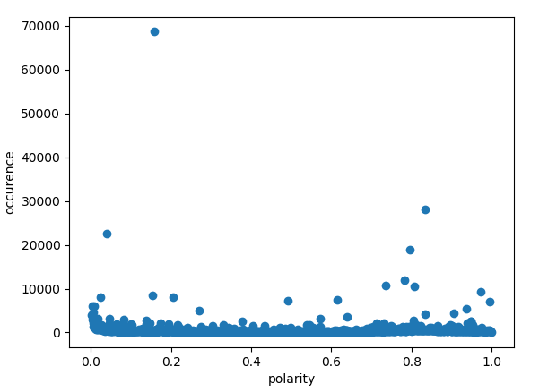

# Analysis of Social Media Data about Singapore

Singapore is a multi-racial and multi-cultural society with 4 main languages. This repository documents the journey to derive insights from textual social media data, from *Twitter* and *Instagram*, about Singapore with the following potential areas of exploration:

1) Proportion of languages used

2) Trending topics

3) Sentiment Analysis on trending topics as well as internal vs external data

4) Named-Entity Recognition 


As no datasets on social media data about Singapore are publicly available, data will be mined from the aforementioned social media platforms using AWS before being used for analysis. As such, this project will be segmented into 4 parts:

1) Data mining using AWS

2) Data cleaning & labelling using NLTK and spaCy

3) Building/Training/Usage of various AI Models

4) Extraction and visualization of results


The following graph showcases the overall approach for this project:


# Data mining using AWS

To collect data from *Twitter* and *Instagram*, we first need to create an EC2 instance on AWS to run the mining scripts indefinitely.

As the scripts are generally lightweight, we do not need heavy computing power. We will hence be using the the basic Amazon Linux instance which will be enough to fulfil our requirements. Although the instance is in the free-tier, please note there are hidden charges after a certain usage duration as well as for data transfer/storage options. Check out the pricing at this link: https://aws.amazon.com/ec2/pricing/


Next, head to AWS RDS to create a database where we will store the collected text data. PostgreSQL will be used in this guide. Note that there are also hidden charges and it is important to first check out their pricing plans before creation of any instances.


It will take a while for AWS to provision your resources. Once it is up and running, go into your database instance to copy its endpoint- we would need this to post data to our database from our ec2 instance. If you run into authentication problems, head to IAM and create a role that allows your AWS RDS instance to interface with your AWS EC2 instance: https://docs.aws.amazon.com/IAM/latest/UserGuide/id_roles.html


We are now ready to run our mining scripts on our ec2 instance(almost)! Access to all tweets must first be authenticated by a user account's key and token. Follow this guide provided by Twitter to generate your access keys and tokens, which would be needed for our Twitter mining scipt: https://developer.twitter.com/en/docs/basics/authentication/oauth-1-0a/obtaining-user-access-tokens.

The *Tweepy* wrapper that modularizes the twitter API will be used to further simplify our mining script, install it in the ec2 instance using pip:
```
pip install tweepy
``` 

For Instagram, we will be mining the captions of posts related to Singapore. Scrapping data via the HTML way will allow us to mine more data as well as avoid having to use the Instagram API. However, they are very good at detecting mining bots and may excercise rate-limiting based on the IP address of the ec2 instance.

The *Instaloader* wrapper is an awesome, well documented library that like Tweepy, modularizes mining functions, making it really simple for us to mine data from instagram. Do check them out: https://github.com/instaloader/instaloader

```
pip install instaloader
```

Lastly, download the *twitter_crawler.py* and *insta_crawler.py* file from this repository and transfer them to your ec2 instance(using transfer protocols such as scp or putty). Do not forget to change the credentials of the database endpoint and Twitter access tokens.

Use the in-built terminal multiplexer to concurrently run both scripts:
```
tmux new -s twitter #creates new instance
tmux attach -t twitter #attaches to the newly created instance
python twitter_crawler.py #starts the mining script
Ctrl+B D #detaches from the terminal instance without terminating the script

--Repeat for insta_crawler.py--
```

To ensure that both scripts are actually mining, we can either access the database through pgAdmin4(browser interface for postgreSQL) or log in via the command line(need to have postgresql installed):
```
sudo -su postgres
psql -h (your aws rds endpoint)
\dt
```

You should see both the *instagram_captions* and the *singapore_tweets* tables present. Use SQL to confirm that they are not empty:
```
SELECT COUNT(id) from singapore_tweets;
SELECT COUNT(id) from instagram_captions;
```


Due to rate limiting, it may take some time to mine a sizable amount of text data. It took around 2 weeks to mine a million tweets. Additionally, a column indicating if the tweet is a retweet or not is saved. As duplicates are allowed, saving the retweet label as a binary count was chosen instead of the actual count. This is because the actual count may lead to unproportional emphasis on the retweet if numbers reflected are high.

# Data Cleaning

Data cleaning is probablity the most important part of the whole process as the model only performs as well as the quality of the data you feed it.

A brief glimpse into the dataset shows that it contains a lot of noise, we will hence clean it based on these conditions:

1) Punctuation - These markers are mostly neutral and does not significantly influence any language tasks.
2) Website links - Useless based on the objectives defined above.
3) Mentioned usernames - Useless based on the objectives defined above.
4) Emoticons - This is a special case: it is not useful when doing tasks like language recognition but may be useful in sentiment analysis.
5) Stop words - Holds little meaning as it serves to structure the sentence. However, it depends on the model used: if the model contextualizes the sentence, it can prove to be useful.

The first three conditions will be done in all cases but conditions 4 and 5 may or may not be done based on the nature of the employed model.

The first three conditions can be easily done in python with an array and iteration through each tweet on the character level(refer to *filter_tweets.py*). Although emoticons can be removed the same way, new emoticons are being created everyday. It is best to use a library that constantly updates their list of reference emoticons to ensure high quality filtering of emoticons:
```
pip install demoji
```

**--Other parts in progress--**

# Proportion of languages used

We begin our analysis by determining the spread of languages used. As most models are only compatible with english, this can help us understand what kind of data we will need in order to build a multilingual model. To first build a language recognition model, we can train it in an unsupervised manner by concatenating different datasets of different languages and train it with labels given based on it's language. However, this will prove to be an arduous task as massive datasets would be needed to account for the languages supported and a large corresponding vocabulary. Fortunately, the research team at *Facebook* have open sourced their language detection model: fastText.

Install the python version of fastText:
```
pip install fasttext
```

Head to this link to download their model that supports an extensive 176 languages: https://fasttext.cc/docs/en/language-identification.html

Subsequently, we use a hash table to count the occurrences of detected languages. We then sort the hash table and visualize the top 20 languages based on our mined dataset before visualizing it using matplot. Refer to *language_visualization.py* for the script used. The obtained bar chart is displayed below:


From our results, it is surprising to see Japanese as the second most used language.

# Sentiment Analysis on English tweets

Subsequently, we can use the earlier results to extract the english tweets related to Singapore. All english tweets which reflect a confidence of more than 0.5 will be used.

The model we will be using is BERT, which was developed by the Google AI research team. This is the current state-of-the-art model due to it's novel architecture that uses bi-directional LSTMs, allowing for contextualization of sentences in both directions as compared to it's predecessors, exceeding prior benchmarks in a series of NLP tasks. Read the paper here: https://arxiv.org/abs/1810.04805

We will be using a pytorch based version as compiled by the awesome NLP researches from *hugging face*, which allows for easy model creation due to it's modularity as well as additionally giving us access to other NLP models if we would like to explore in the future.
```
pip install pytorch-transformers
```

As BERT was trained on the Wikipedia corpus, this may lead to inaccuracies for our task as the sentence structures that BERT was trained on defers from our more informal tweets. As such, we will be using transfer learning by fine-tuning BERT using the Sentiment140 dataset, which consists of 1.6 million evenly labels english tweets(postive/negative), that was used in research. 

Dataset: https://www.kaggle.com/kazanova/sentiment140

Research paper: *Go, A., Bhayani, R. and Huang, L., 2009. Twitter sentiment classification using distant supervision. CS224N Project Report, Stanford, 1(2009), p.12*

As the dataset has already been cleaned and labelled for us, we can start building/training the model straight away. Please refer to *bert_training_script.py* in this repository for the code used to train BERT.

When working with very large datasets, it does not make sense to load the whole dataset into memory due to the lack/wastage of computing resources. It is thus good to understand the usage of the *IterableDataset* class used from Pytorch. This enables concurrent reading/pre-processing and training of the model at the same time, via the CPU and GPU working in tandem, ensuring that only a fraction of data is in memory at any given time, greatly saving computational resources.

Bert is a large model by itself which means that we probably will take a very long time with a mediocre GPU instance. As such, we will also be training BERT on multiple GPU instances on AWS SageMaker, which is a managed machine learning platform that makes it very easy for development/training and testing of AI models. The good thing about SageMaker it is very fast and easy to create jupyter notebooks to host your models and they only bill you for the exact time you take run the instance, unlike EC2 where there are hidden costs and it is harder to start/stop your resources. However, multi-GPU instances are very expensive and you should visit this link to be aware of the charges before proceeding: https://aws.amazon.com/sagemaker/pricing/

It is a good practice to ensure the training script can run locally on your computer become starting the instance to get the most out of your instance.

Head to SageMaker and create a new notebook instance. I created one in the North Virgina region as it was the cheapest. You can change your region in the top right corner:



We will be choosing the ml.p3.16xlarge instance which consists of 8xV100 GPUs, this will cut down training time from a day on a regular GPU to just 50 mins for our given dataset of 1.6 million samples. GPU types/quantities per instances are available at the same pricing link above. Please note that if you are saving the model straight into an AWS S3 bucket as per the approach map at the start of this repository, you would need give permissions to the S3 bucket when initializing the instance, or you can select and use a role which has access to S3. 



Your resources may take a while to provision. Once done, launch the notebook and copy the code from *bert_training_script.py* in the jupyter. Alternatively, you can launch the script via the command line in your SageMaker instance.


The code in the script has been edited to be compatible to train on mulitple GPUs using the DataParallel class from Pytorch. Head to this link if you wish to learn more about it: https://pytorch.org/tutorials/beginner/former_torchies/parallelism_tutorial.html

Adjust the tunable parameters in the code to make the most use of the GPU resources. Using a hash table, we can determine the optimal length to use, in this case, we will be using a MAX_LEN of 32 as more than 95% of tweets are encompasses within 32 words:
 


It may also be helpful to query *nvidia-smi* on the terminal to achieve the highest possible batch size. If you are also using the ml.p3.16xlarge instance, a good batch size is 2624. This maximizes all GPUs almost evenly:



After training of 4 epochs, we achieve an test accuracy of **84.8%**. We then use this to predict the sentiment of the english tweets we mined, results are displayed in the chart below (0 means negative while 1 means positive):



The mean sentiment scores computed was **0.534**, meaning the average sentiment of all english tweets were largely neutral but with a minute positive nature. Future updates will explore the validity of this score as well as topic-wise/multi-lingual sentiment analysis.


**--Other parts in progress--**


